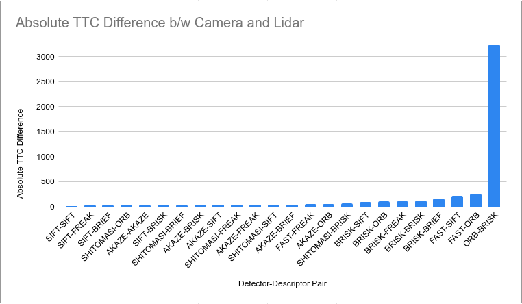

# 3D Object Tracking

## Implementation Details

### Computing Lidar TTC
#### 1. Matching 2D Bounding Boxes
Once we've detected bounding boxes over obstacles between one frame and the next, 
we need to match each ostacle's bounding box from the previous frame to it's corresponding bounding box in the next frame. Through this, we track these obstacles through a series of frames. 

Assume we have keypoints and their descriptions for every pair of sequential frames as well as their matches. For a certain pair of sequential frames, we iterate over every keypoint match, and log the corresponding bounding boxes in both frames. Then, for every one of the bounding boxes in the previous frame that contains a keypoint match, we select the bounding box that it was most often matched to as the corresponding box in the next frame. 

#### 2. Computing Lidar TTC
Assume we have appropriately projected all Lidar points onto the camera image using the given extrinsic and intrinsic matrices. 

For the matched bounding boxes in the current and previous frame, we capture the Lidar points that are contains within each. Conceptually, we should then calculate the minimum `x` point in both Lidar point clouds and compute the TTC using 
$$TTC = \frac{min_{curr}*\Delta t}{min_{prev} - min_{curr}}$$

However, these Lidar point clouds can contain outliers. Since most `x` points for each bounding box lie on the bumper, we select $min_{frame}$ to be the median point on the $x$-axis. 

### Computing Camera TTC
#### 1. Associating Keypoints Matches within each Bounding Box
In order to compute the TTC from Camera keypoints, we need to find the keypoint matches that fall within approximately same bounding box. For a given bounding box and the keypoints that lie within, we find the distance between each keypoint match. 
We then compute the average distance between all keypoint matches. Then, we only keep
the keypoint matches who's distance is within 1.5 of the mean distance. 

#### 2. Computing Camera TTC
Conceptually, computing the TTC is based on the size of the obstacle's bounding box in the previous and current frame. However, since that is not a reliabile measure, we take advantage of the keypoints instead. 

For every pair of keypoints in the bounding box in the previous frame, compute the distance between them. Then, we find the distance between every corresponding pair of keypoints in the current frame using the keypoint matches. Finally, we compute the ratio of distances between every pair of keypoint matches. 

The TTC is calculated using the median distance ratio: $$TTC = \frac{-\Delta t}{1 - ratio}$$

### Performance Evaluation
#### Some Examples where Lidar TTC seems off

##### Example 1: The Lidar TTC increases

and it's associated Lidar BEV:

Although the minimum $x$ point is reasonable and would likely provide a better estimate of the TTC, the median $x$ points that we selected for each sequence must've made it such that it seems like we're going much slower in the second sequence than the first. 

##### Example 2: The Lidar TTC falls drastically

Similar to the last example, this error must be due to our manual selection of median points, and our selection must've made it such that it seems like we're going much _faster_ in the second sequence than the first. 

#### Descriptor/Detector TTC Performance
**The `eval_results` folder contains 3 files:** A text file containing the Lidar TTC for each pair of sequential frames (`lid.txt`), and 2 CSVs containing the Camera TTC (`cam.csv`) and absolute difference between Lidar and Camera TTC for the same sequence of pairs (`dif.csv`).

Based on the total absolute TTC difference from all sequences, the SIFT-based detection methods performed the best. 

##### Some Examples where Camera TTC is off
Here are a couple examples where the Camera TTC is wildly off: 

**1. Using FAST detector and ORB descriptor**

**2. Using ORB detector and BRISK descriptor**

These are likely due to very poor matches between keypoints and thus the distance ratios between keypoint matches were too large. 

## Basic Build Instructions

1. Clone this repo.
2. Make a build directory in the top level project directory: `mkdir build && cd build`
3. Compile: `cmake .. && make`
4. Run it: `./3D_object_tracking`.
