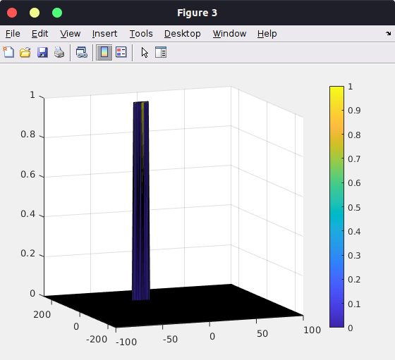

## Radar Target Generation and Detection

### Results
#### Range FFT

#### Range-Doppler FFT

#### CFAR Result

### Implementation Details
**1. 2D CFAR process**
To properly detect targets in the Range-Doppler estimate, we utilize CA-CFAR (Cell Averaging - Constant False Alarm Rate). CA-CFAR first starts by defining parameters `T` & `G`, the number of training and guard cells. We then create a window of size `2T + 2G` and slide it over the entire 2D FFT. For each window, we calculate the average noise in all training cells and compare it to the current point in the 2D FFT. If the current point is above the threshold, we indicate that a target is present at that range/velocity. 

There is also an `offset` variable which we apply to the threshold to add 
**2. Training, Guard cells, and Offset**
The training and guard cells were chosen such that for every target point, we don't leak out the target signal to the noise estimate. `G=4` in both directions seemed like an empirically good choice, and I chose `T=10` and `T=8` in the range and doppler directions respectively. This is because I felt that we needed a wider window for the range axis as that seemed to have a wider target distribution. The `offset=7` was chosen from running the CFAR multiple times and finding the best value. 

**3. Edge Cells**
Since the 2D CA-CFAR algorithm cannot reach the edges, we automatically suppress those cells to 0. 